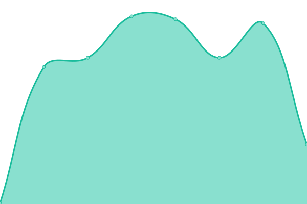
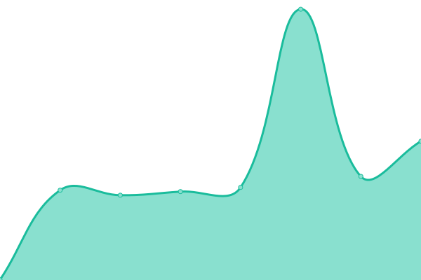

# [📈 Live Status](https://rishikesh-parspec.github.io/pp-app-status): <!--live status--> **🟩 All systems operational**

This repository contains the open-source uptime monitor and status page for [rishikesh-parspec](https://rishikesh-parspec.github.io/pp-app-status), powered by [Upptime](https://github.com/upptime/upptime).

With [Upptime](https://upptime.js.org), you can get your own unlimited and free uptime monitor and status page, powered entirely by a GitHub repository. We use [Issues](https://github.com/rishikesh-parspec/pp-app-status/issues) as incident reports, [Actions](https://github.com/rishikesh-parspec/pp-app-status/actions) as uptime monitors, and [Pages](https://rishikesh-parspec.github.io/pp-app-status) for the status page.

<!--start: status pages-->
<!-- This summary is generated by Upptime (https://github.com/upptime/upptime) -->
<!-- Do not edit this manually, your changes will be overwritten -->
<!-- prettier-ignore -->
| URL | Status | History | Response Time | Uptime |
| --- | ------ | ------- | ------------- | ------ |
|  [Rishikesh](https://www.google.com) | 🟩 Up | [rishikesh.yml](https://github.com/rishikesh-parspec/pp-app-status/commits/HEAD/history/rishikesh.yml) | 

 85ms
     
 | 

<a href="https://rishikesh-parspec.github.io/pp-app-status/history/rishikesh">100.00%</a>
    

|  [Inventory Service](https://inventory.parspec.io/inventory-service/marco) | 🟩 Up | [inventory-service.yml](https://github.com/rishikesh-parspec/pp-app-status/commits/HEAD/history/inventory-service.yml) | 

 272ms
     
 | 

<a href="https://rishikesh-parspec.github.io/pp-app-status/history/inventory-service">100.00%</a>
    

|  [workato-connector-health-staging](https://apim.workato.com/parspecdev/connector-health-vv1/connector-health-check) | 🟩 Up | [workato-connector-health-staging.yml](https://github.com/rishikesh-parspec/pp-app-status/commits/HEAD/history/workato-connector-health-staging.yml) | 

 660ms
     
 | 

<a href="https://rishikesh-parspec.github.io/pp-app-status/history/workato-connector-health-staging">100.00%</a>
    

|  [🔌 parspec connector](https://apim.workato.com/parspecdev/connector-health-vv1/parspec-connector) | 🟩 Up | [parspec-connector.yml](https://github.com/rishikesh-parspec/pp-app-status/commits/HEAD/history/parspec-connector.yml) | 

 775ms
     
 | 

<a href="https://rishikesh-parspec.github.io/pp-app-status/history/parspec-connector">100.00%</a>
    

<!--end: status pages-->

[**Visit our status website →**](https://rishikesh-parspec.github.io/pp-app-status)

## 📄 License

- Powered by: [Upptime](https://github.com/upptime/upptime)
- Code: [MIT](./LICENSE) © [Anand Chowdhary](https://anandchowdhary.com), supported by [Pabio](https://pabio.com)
- Data in the `./history` directory: [Open Database License](https://opendatacommons.org/licenses/odbl/1-0/)
